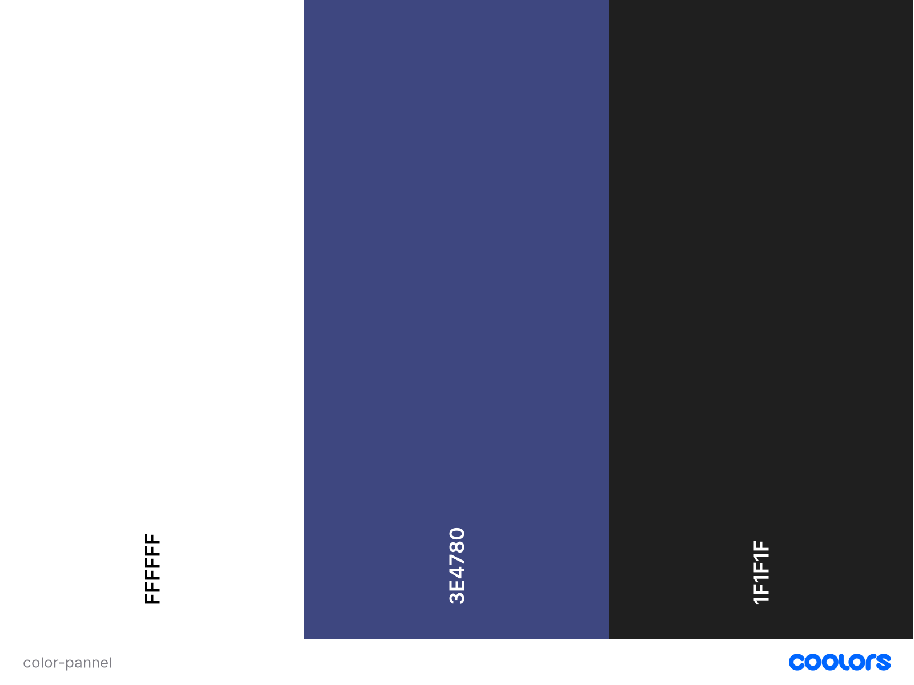

 # Portfolio 
Lien vers le [Portfolio](https://djony-herbaut.github.io/Portfolio_2024/)

Bonjour, je suis Djony Herbaut et j'ai 20 ans. 

Je suis actuellement étudiant en 2ème année à l'école ITIC Paris et 
en alternance à Thalès DIS France.

# Réalisation 
Pour réaliser la page d'accueil, je me suis d'abord concentré sur la réalisation du wireframe, sur le choix de la police (Roboto, Sans Serif) mais aussi du fonctionnement globlal de la navigation (1 seul sens de navigation avec un menu qui renvoie vers des ancres ou des pages à part entière : page de contact)

# Charte graphique/typographique

En ce qui concerne la charte typographique j'ai choisi une font-family: 'Roboto', sans-serif. 
Et j'ai appliqué la charte graphique ci dessous :

